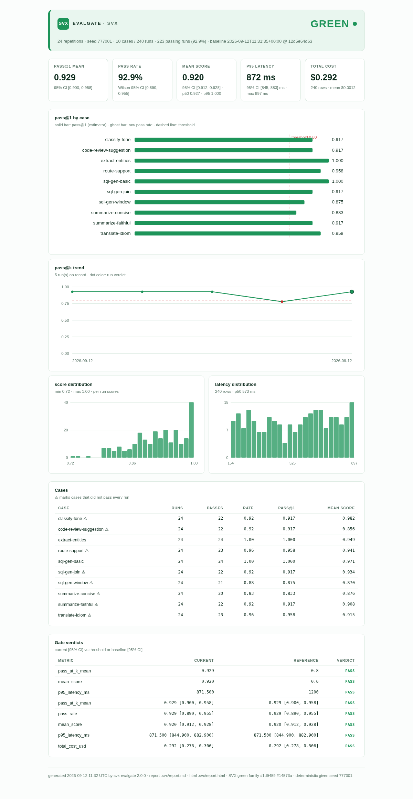
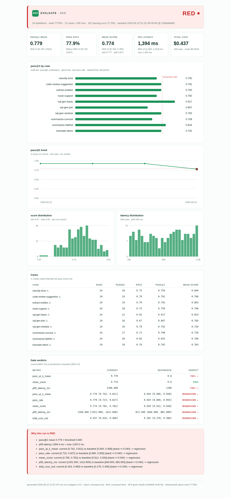

# SVX EvalGate

**Deterministic statistics for non-deterministic software.** EvalGate wraps the eval suite you already run and turns its flaky output into one ordinary, trustworthy **green-or-red check on your pull request**.


-747d78?style=flat-square)


[](https://github.com/srivtx/svx-evalgate/actions/workflows/ci.yml)

---

## The problem

Your LLM feature shipped with evals. Your team wrote them, ran them in a notebook, saw **87% pass**, and felt good. Then the evals moved into CI - and everything broke:

- The suite passes on one run, fails on the next. Someone adds `--retries 3`. Now it always passes, including when the model got worse.
- Somebody rewrites a prompt in a PR. The evals run once, come back green, and merge - because one sample of a non-deterministic system says nothing.
- Someone asks "is the model *better* than last month?" There is no answer, because nothing was ever recorded.

This is the gap SVX Research ranked **#1 of twelve** validated opportunities in the [SVX Industry Gap Analysis 2025-2026](https://github.com/srivtx/svx-research): eval platforms monetize dashboards and judge-token spend, so none of them is structurally motivated to make the CI gate itself excellent. The field is empty at exactly the moment every team is shipping AI features - **362 documented AI incidents in 2025, up from 233 the year before, while enterprise LLM spend doubled in six months.**

## What EvalGate does

```
              your eval suite               EvalGate                  your PR
        ┌────────────────────────┐   ┌────────────────────────┐   ┌──────────┐
        │  python evals/run.py   │──▶│  24 seeded repetitions │──▶│  GREEN   │
        │  prints JSON lines     │   │  pass@k  per case      │   │  or      │
        │  (any runner)          │   │  Wilson + bootstrap CI │   │  RED     │
        └────────────────────────┘   │  regression bands      │   └──────────┘
                                     └────────────────────────┘
```

| Capability | What it actually means |
|---|---|
| **pass@k** | The unbiased combinatorial estimator from the Codex/HumanEval paper, computed per eval case: the probability the case passes at least once in k runs. Not "did my single sample pass". |
| **Fixed seeds** | Every repetition runs your command with `SVX_SEED = base_seed + i`. Same seed in, same verdict out - flaky gates are a design failure, not a fact of life. |
| **Regression bands** | A committed baseline (`.svx/baseline.json`) records what "good" means - value *and* confidence interval. A PR goes red only when the current run's entire interval sits below the baseline's interval minus your tolerance: noise cannot separate two intervals from the same distribution. |
| **Latency + cost (v2)** | Rows may carry `latency_ms` and `cost_usd`. EvalGate computes p50/p95/max latency with bootstrap CIs, total and mean cost, and gates on upper bounds (`max_p95_latency_ms`, `max_total_cost_usd`) and on regressions - direction-aware, because slower/costlier is worse, not better. |
| **HTML report (v2)** | Every run writes a self-contained `.svx/report.html` - metric cards, per-case bars, trend line across runs, score and latency histograms - inline SVG, zero external resources, works from `file://` and CI artifacts. |
| **Run history (v2)** | Every run appends to `.svx/history.jsonl` (bounded, trimmed). `evalgate trend` prints the table plus a unicode sparkline; the HTML report plots it. |
| **JUnit XML (v2.1)** | Every run writes `.svx/report.xml` - gate verdicts as a native CI test report. GitLab (`artifacts:reports:junit`), Jenkins, and Azure render the gate directly in the test tab, statistical evidence inline in each failure. |
| **Pytest ingestion (v2.1)** | `evalgate ingest --format pytest-junit report.xml` gates an ordinary pytest suite with zero wrapper code: every test becomes a case, failures become failed rows, durations become latency observations. |
| **`evalgate diff` (v2.1)** | Compare two metric snapshots at the command line - baseline vs last run by default, or two files. Same interval-vs-interval logic as the gate: a metric is only WORSE when confidently worse. |
| **Per-case floors (v2.1)** | `gate.case_min_pass_at_k` sets minimum pass@k per case - the flagship query can be held to 0.95 while exploratory cases float with the aggregate. Absent cases produce a loud note, never a silent pass. |
| **Bootstrap CI** | Seeded percentile bootstrap for score means and percentiles - deterministic, because the seed derives from a stable digest of (base_seed, metric). |
| **Zero dependencies** | Pure Python standard library. Installs in seconds, runs anywhere, has no supply chain. |
| **Plays well with others** | EvalGate does not host your evals, judge them, or store them. It is not another platform. It connects whatever you already run to the workflow engineers already trust. |

## Quickstart

**Zero-to-gated in four commands** - scaffold a config and a runnable demo suite, then let the statistics do the talking:

```bash
pip install svx-evalgate
evalgate init                  # writes svx.evalgate.yaml + evals/run_evals.py
evalgate run --update-baseline # first run: record what good looks like
evalgate run                   # every run after: gate against it
```

Or wire an existing suite by hand:

**1. Wrap your eval suite.** Make your runner print one JSON object per line per invocation:

```json
{"case": "sql-gen-basic", "passed": true, "score": 0.93, "latency_ms": 812.4, "cost_usd": 0.0013}
```

`passed` is required; `score`, `latency_ms`, `cost_usd` are optional (numbers >= 0 when present). A ten-line wrapper around pytest, a notebook, or an existing harness is the entire integration.

**2. Add the config** (`svx.evalgate.yaml` in the repo root):

```yaml
evals:
  command: "python evals/run_evals.py"
  repetitions: 24
  base_seed: 777001

gate:
  k: 1
  min_pass_at_k: 0.80
  min_mean_score: 0.60
  max_p95_latency_ms: 1200    # optional (v2)
  max_total_cost_usd: 1.00    # optional (v2)
  case_min_pass_at_k:         # optional (v2.1): per-case floors
    sql-gen-basic: 0.90
  regression:
    mode: absolute        # or "relative"
    tolerance: 0.04
```

**3. Install and run locally** (same verdict as CI, because seeds):

```bash
pip install svx-evalgate      # or: pip install git+https://github.com/srivtx/svx-evalgate
evalgate run --update-baseline   # first run: record what good looks like
evalgate run                     # every run after: gate against it
evalgate run --json              # machine-readable verdict for bots and dashboards
evalgate trend                   # (v2) recent runs + sparkline
evalgate baseline reset          # (v2) drop the baseline, re-record on next run
evalgate ingest report.xml       # (v2.1) gate an existing pytest JUnit report
evalgate diff                    # (v2.1) baseline vs last run, exit 1 if confidently worse
```

Exit codes: `0` green · `1` red (threshold or regression) · `2` error. Add `--json` for a machine-readable document (verdict, reasons, every metric with its confidence interval - latency and cost included - failing cases, baseline state) — for non-GitHub CI systems, dashboards, or chat bots that post the gate result.

**4. Gate your pull requests** - `.github/workflows/evalgate.yml`:

```yaml
name: evalgate
on:
  pull_request:
  push:
    branches: [main]
permissions:
  contents: write
  pull-requests: write
jobs:
  gate:
    runs-on: ubuntu-latest
    steps:
      - uses: actions/checkout@v4
      - uses: srivtx/svx-evalgate@v2     # the action installs and runs the gate
        with:
          update-baseline: ${{ github.ref == 'refs/heads/main' }}
```

Pushes to `main` refresh the baseline; PRs are gated against it. The check posts a full report to the PR - metric table, per-case pass@k, confidence intervals, latency and cost statistics, baseline provenance - and to the job's step summary.

## The HTML report (v2)

Every run also writes a **self-contained HTML report** - one file, inline SVG, no external fonts or scripts, so it renders identically in a browser, from `file://`, and in CI artifacts:



A regression run paints the same page red, with the statistical evidence for *why* - intervals against intervals, direction-aware for latency and cost:



## CI-native outputs (v2.1)

**JUnit XML on every run.** `.svx/report.xml` (disable with `report.junit_path: ~`) expresses the gate as an ordinary test report: threshold checks under `evalgate.gate`, regression checks under `evalgate.regression`, per-case floors under `evalgate.cases`. Point GitLab's `artifacts:reports:junit` at it - or Jenkins, or Azure - and the gate lands in the test tab engineers already watch, with the statistical evidence inline in every failure:

```xml
<testcase classname="evalgate.regression" name="p95_latency_ms" time="0">
  <failure type="assert"
           message="p95_latency_ms = 1394.400 regressed vs baseline 871.500 (band +/-0.040)">
    p95_latency_ms: current [1351.900, 1412.600] vs baseline [844.900, 882.900]
    (band +/-0.040) -> regression
  </failure>
</testcase>
```

**Ingest instead of wrap.** Already have a pytest suite? Gate it with zero emitter code:

```bash
pytest --junitxml=report.xml
evalgate ingest --format pytest-junit report.xml
```

Every test becomes a case, failures and errors become failed rows, skipped tests are dropped (a skip is the absence of a data point, not a failure), and durations become latency observations - so `max_p95_latency_ms` and the latency regression bands that gate LLM evals also catch a test suite that quietly got 40% slower. The full pipeline runs exactly as for `evalgate run`: baseline, thresholds, all three reports, history.

**Diff any two snapshots.** `evalgate diff` compares the baseline against the last run by default, or two snapshot files you name:

```console
$ evalgate diff
metric            A                         B                    delta      rel  verdict
pass_at_k_mean    0.9292 [0.9000, 0.9583]  0.7792               -0.1500  -16.1%  WORSE
p95_latency_ms    871.5 [844.9, 882.9]     1394.4               +522.9   +60.0%  WORSE
...
confidently worse: pass_at_k_mean, pass_rate, mean_score, p95_latency_ms, total_cost_usd
```

Exit 1 when any metric is *confidently* worse (same band logic as the gate - noise never trips it), which makes diff a cheap post-deploy smoke check.

**Per-case floors.** Some cases matter more than the aggregate average:

```yaml
gate:
  case_min_pass_at_k:
    sql-gen-basic: 0.90      # the flagship query must be rock solid
    sql-gen-window: 0.75     # window functions are allowed to flake
```

A case below its floor is RED with its own evidence line (`case 'sql-gen-basic': pass@1 0.625 < required 0.900 (15/24 runs passed)`), its own JUnit testcase, and its own row in the report's threshold table. A configured case missing from the run produces a loud note - renames can't silently bypass the floor.

**GitLab CI.** A ready-to-paste `.gitlab-ci.yml` with baseline refresh on the default branch and the JUnit report wired in: [docs/gitlab-ci.md](docs/gitlab-ci.md).

## The report you get on every PR

```markdown
## EvalGate - GREEN

Deterministic statistics for `24` repetitions (base seed `777001`) across **10 case(s) / 240 runs**.

### Thresholds

| Metric | Current | 95% CI | Required | Verdict |
|---|---:|---:|---:|---|
| `pass_at_k_mean` | 0.921 | [0.867, 0.971] | min 0.800 | PASS |
| `mean_score` | 0.919 | [0.911, 0.927] | min 0.600 | PASS |

### Regression vs baseline

| Metric | Current [CI] | Baseline [CI] | Band | Verdict |
|---|---|---|---:|---|
| `pass_at_k_mean` | 0.921 [0.867, 0.971] | 0.921 [0.867, 0.971] | +/-0.040 | PASS |
| `pass_rate` | 0.921 [0.880, 0.949] | 0.921 [0.880, 0.949] | +/-0.040 | PASS |
| `mean_score` | 0.919 [0.911, 0.927] | 0.919 [0.911, 0.927] | +/-0.040 | PASS |

### Pass@1 by case

| Case | Runs | Passes | Pass rate | pass@1 |
|---|---:|---:|---:|---:|
| `sql-gen-basic` | 24 | 24 | 1.00 | 1.000 |
| `sql-gen-join` | 24 | 24 | 1.00 | 1.000 |
| `translate-idiom` | 24 | 20 | 0.83 | 0.833 |
...
```

Full example: [`examples/llm-app/`](examples/llm-app/) - a complete demo project with a seeded mock eval suite. Reproduce the whole story in ~30 seconds:

```bash
cd examples/llm-app
evalgate run --update-baseline      # GREEN: baseline recorded
DEMO_MODE=regression evalgate run   # RED:   regression caught, exit 1
evalgate run                        # GREEN: back within band
```

## How the statistics work

**pass@k.** For a case run `n` times with `c` passes, the unbiased estimator of "passes at least once in k future runs" is `1 − C(n−c, k) / C(n, k)` (Chen et al., 2021). It is exact, closed-form, and never flaps. EvalGate reports it per case and aggregates the mean.

**Latency and cost (v2).** Latency percentiles use the nearest-rank method (deterministic across platforms - a sort and an index, no interpolation). Their bootstrap CIs resample rows and recompute the percentile, capped at 2,000 iterations so gated runs stay fast. Total cost is the row sum; its interval bootstraps the per-row mean and scales by the row count. Both metrics gate on upper bounds and on regression bands with inverted direction: REGRESSION when the current interval sits entirely *above* the baseline's interval plus the band.

**Regression bands.** The baseline stores each metric's confidence interval alongside its value (Wilson intervals for rates, seeded bootstrap for means and pass@k). A PR is called REGRESSION only when the current run's *entire* interval sits below the baseline's interval minus your tolerance - i.e. the run is confidently worse than the baseline by more than the band. Overlapping intervals are PASS, which is what makes the gate flake-proof: sampling noise moves point estimates around, but it cannot separate two intervals drawn from the same distribution. The band width is yours to choose, absolute or relative.

**Determinism.** Nothing in the pipeline uses wall-clock time, `hash()`, or unseeded randomness. Sub-seeds derive from SHA-256 of `(base_seed, metric name)`. The test suite proves it: two full runs with the same seed produce byte-identical reports, including the bootstrap.

## Why a gate and not a dashboard

The research finding worth repeating: eval platforms live in dashboards *outside* the workflow, where a regression is an email nobody reads at 6 p.m. on Friday. The merge gate is the only control point every engineer already obeys. EvalGate is deliberately narrow - it wraps existing suites in deterministic statistics and posts one check - because that narrowness is the moat. The big platforms cannot monetize "make the CI adapter excellent"; a small team can make it perfect.

## Configuration reference

| Key | Default | Meaning |
|---|---|---|
| `evals.command` | `python evals/run_evals.py` | Shell command; runs `repetitions` times |
| `evals.repetitions` | `20` | Repetitions per gate evaluation |
| `evals.base_seed` | `20260912` | `SVX_SEED = base_seed + i` per repetition |
| `evals.working_dir` | config dir | cwd for the eval command |
| `evals.bootstrap_iterations` | `10000` | Bootstrap resample count (seeded) |
| `gate.k` | `1` | k for per-case pass@k |
| `gate.min_pass_at_k` | `0.85` | Aggregate threshold on mean pass@k |
| `gate.min_mean_score` | *(off)* | Optional threshold on mean score |
| `gate.max_p95_latency_ms` | *(off)* | v2: RED when p95 latency exceeds this |
| `gate.max_total_cost_usd` | *(off)* | v2: RED when total cost exceeds this |
| `gate.case_min_pass_at_k` | *(off)* | v2.1: per-case pass@k floors (`case: 0.9` mappings) |
| `gate.regression.mode` | `absolute` | `absolute` or `relative` (fraction of baseline) |
| `gate.regression.tolerance` | `0.05` | Band width before REGRESSION |
| `baseline.path` | `.svx/baseline.json` | Baseline location (commit it) |
| `baseline.auto_write_on_missing` | `false` | Write a baseline on first run |
| `report.path` | `.svx/report.md` | Markdown report location |
| `report.html_path` | `.svx/report.html` | v2: HTML report location (`~` disables) |
| `report.junit_path` | `.svx/report.xml` | v2.1: JUnit XML location (`~` disables) |
| `history.enabled` | `true` | v2: append run summaries to history |
| `history.path` | `.svx/history.jsonl` | v2: run history location (do not commit) |
| `history.max_entries` | `500` | v2: trim oldest beyond this many entries |

JSON configs (`svx.evalgate.json`) are supported natively. The YAML subset parser handles the schema above with zero dependencies; anything exotic, use JSON.

## Design guarantees

- **The gate never flakes.** Same seed, same verdict - enforced by `test_same_seed_same_verdict_and_metrics` - and a different seed on an unchanged system stays green too (`test_noise_with_different_seed_stays_green`).
- **CI failures mean what they say.** Exit 1 only on a threshold miss or a statistically confident regression; exit 2 for config/command errors; PR-comment failures degrade to warnings and never fail your build.
- **Your evals stay yours.** JSONL on stdout is the entire contract. No vendor format, no lock-in, no upload.
- **No dependencies.** Stdlib only - `pip install` has nothing to resolve.

## Repository layout

```
evalgate/            the package (config, runner, stats, baseline, gate, report, github,
                     history, htmlreport, junitxml, adapters, diff, init, cli) -
                     mypy-clean, ruff-clean
tests/               264 tests: statistics property tests, gate logic, config/runner,
                     HTML report rendering (incl. XSS escaping), JUnit XML, ingestion
                     adapters, diff, history, full e2e
examples/llm-app/    complete demo: seeded mock suite with latency + cost, config,
                     regression walkthrough
action.yml           GitHub Action (composite, installs and runs the gate)
docs/methodology.md  the statistics, precisely: pass@k, Wilson, seeded bootstrap,
                     percentiles, interval-vs-interval, direction-aware bands
docs/gitlab-ci.md    v2.1: GitLab CI recipe with JUnit reports and baseline refresh
docs/assets/         screenshots of the HTML report (green and red)
.github/workflows/   ci.yml (lint + tests w/ coverage gate + self-checks),
                     evalgate.yml (dogfooding), release.yml (build + opt-in PyPI)
CHANGELOG.md         every user-visible change, per release
CONTRIBUTING.md      ground rules (determinism is the product)
SECURITY.md          reporting and scope
```

## Origin

EvalGate builds **gap #1** of the [SVX Industry Gap Analysis 2025-2026](https://github.com/srivtx/svx-research): the evals-in-CI adapter - "the sharpest unmet need found in the entire research," ranked first of twelve opportunities by evidence strength, openness of the field, and realism of a small-team distribution model. The research repo contains the full evidence base: 362 documented AI incidents in 2025, the collapse of manual verification under AI code volume, and the structural reasons the incumbent platforms will not build this themselves.

## Roadmap

- [x] `evalgate init` scaffolding (v1.1.0)
- [x] `--json` machine-readable output (v1.1.0)
- [x] Latency + cost statistics, thresholds, and regression tracking (v2.0.0)
- [x] Self-contained HTML report with inline SVG charts (v2.0.0)
- [x] Run history + `evalgate trend` + `evalgate baseline reset` (v2.0.0)
- [x] Ruff + mypy clean, coverage gate at 85% in CI (v2.0.0)
- [x] JUnit-XML output + pytest report ingestion, zero-wrapper (v2.1.0)
- [x] `evalgate diff` - compare snapshots at the command line (v2.1.0)
- [x] GitLab CI recipe + generic exit-code contract (v2.1.0)
- [x] Per-case pass@k floors (v2.1.0)
- [ ] PyPI publication (workflow is ready; awaiting trusted-publisher setup)
- [ ] More ingestion formats: Go test JSON, Jest, vitest (same row pipeline)
- [ ] `evalgate why` - explain a RED verdict in plain language

Versioning policy: minor releases add capabilities, patch releases fix
them; majors only for contract breaks. The tool is young - it earns a
3.0 by proving 2.x in real pipelines, not by ambition.

## License

MIT - see [LICENSE](LICENSE). Part of SVX Research.
